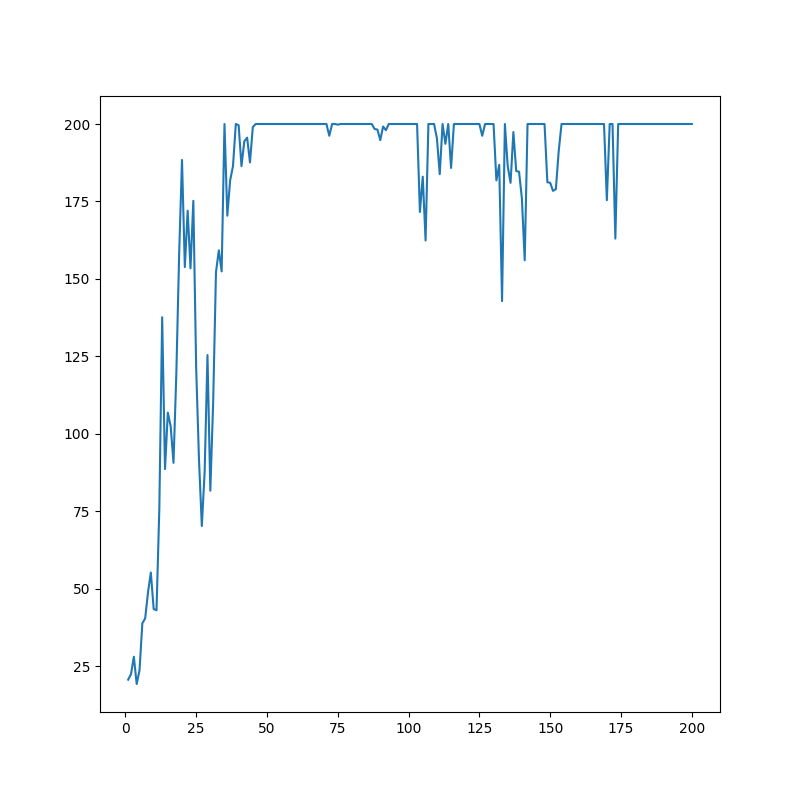

# A2C

A2C stands for Advantage Actor Critic (read the paper [Asynchronous Methods for Deep Reinforcement Learning](https://arxiv.org/abs/1602.01783v2)).

In policy gradient methods, we are trying to find the optimal policy function (a neural net outputs probability distribution of actions to take). In value based methods, we are trying to find the value network(s) (Q and V) and the optimal policy is just picking the action with maximum expected reward, i.e., max(Q(s, a)) in each state. In Actor-Critic methods, we train both policy network(s) and value network(s).

Using A2C, we see the agent gets max return by epoch 50. Time to reach epoch 50 (for Apple M1 8GB) is <5s. Make sure to install the required packages.

To start, do this in terminal

1. create a virtual env by running `virtualenv path/to/virtualenv`
2. run `cd path/to/virtualenv`, then `source bin/activate` to activate env
3. clone repo using `git clone`, then run `mv A2C/* .` and `rm -rf A2C`
4. install packages using `pip install -r requirements.txt`
5. make folder to store train checkpoints - `mkdir checkpoints`
6. train the agent by running `python3 train.py > checkpoints/output.txt`
7. test the agent by running `python3 play.py --render True`
